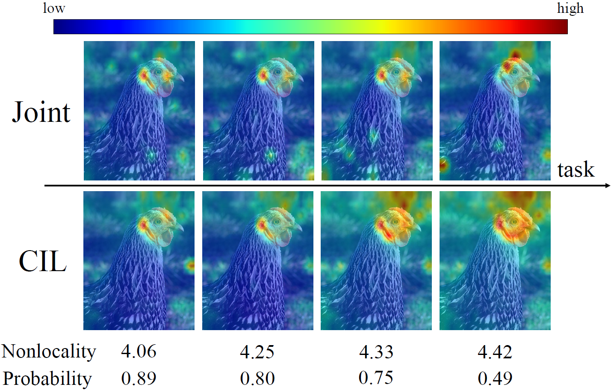

# Preserving Locality in Vision Transformer for Class Incremental Learning
This repo is the source code of our ICME 2023 paper, Preserving Locality in Vision Transformer for Class Incremental Learning.



TL; DR: we find that when the ViT is incrementally trained, the attention layers gradually lose concentration on local features. 
Therefore, we encourage
the model to preserve more local information and devise a Locality-Preserved Attention (LPA) layer to emphasize the importance of local features.

# To Run the Code
The template command is
```
./run.sh {gpu_ids} --configs {configs} --log-dir ./logs
```

For example, to run cifar100
```
bash ./run.sh 0,1 --configs configs/data/cifar100_10-10.yaml configs/data/cifar100_order1.yaml configs/model/cifar_raw_lpa.yaml --log-dir ./logs
```

There are other useful options:

`--enable-logfile`: log the outputs in `--log-dir` specified.

`--debug`: only train each task for 5 epochs, useful for sanity check.


# Acknowledgment

This repo uses [continuum](https://pypi.org/project/continuum/) and [DyTox](https://github.com/arthurdouillard/dytox).